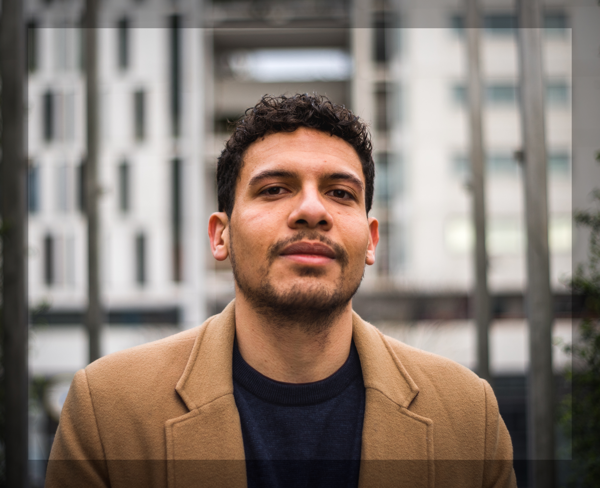

  
  

    <h1 style="margin: 0 0 8px 0;">Thibault Randrianarisoa</h1>
    

      Tenure-track Assistant Professor in Statistics, University of Toronto
    

    

      <strong>Pronunciation:</strong> /<a href="https://ipa-reader.com/?text=tibo&voice=Joey" target="_blank">tibo</a> <a href="https://ipa-reader.com/?text=%CA%81%C9%91%cc%83d%CA%81iana%CA%81izoa&voice=Joey" target="_blank">ʁãdʁianaʁizoa</a>/
    

    

      <a class="btn btn-outline-primary btn-sm" href="https://thibaultrandrianarisoa.netlify.app/" target="_blank">Personal Webpage</a>
      <a class="btn btn-outline-secondary btn-sm" href="https://thibaultrandrianarisoa.netlify.app/cv2.pdf" target="_blank">Curriculum Vitae</a>
      <a class="btn btn-outline-dark btn-sm" href="https://github.com/TRandrianarisoa" target="_blank">GitHub</a>
    

  

---

## Short Biography

I am currently a tenure-track Assistant Professor in Statistics at the [Department of Computer & Mathematical Sciences](https://utsc.utoronto.ca/cms/), University of Toronto Scarborough, and the [Department of Statistical Sciences](https://www.statistics.utoronto.ca/), University of Toronto (since September 2025).

Previously, I was a Postdoctoral Fellow in the same department, working with [Daniel Roy](http://danroy.org). Before joining the UofT, I was a Postdoctoral researcher at [BIDSA](https://bidsa.unibocconi.eu), [Bocconi University](https://www.unibocconi.eu) (Milan, Italy), mentored by [Botond Szabó](https://botondszabo.com). I completed my PhD in Statistics at [Sorbonne Université](https://www.sorbonne-universite.fr/en) (Paris, France), where I worked in the [LPSM](https://www.lpsm.paris) lab under the supervision of [Ismaël Castillo](https://perso.lpsm.paris/~castillo/).

My PhD manuscript can be found [here](https://hal.archives-ouvertes.fr/view/index/docid/3890739).

### Research Grants & Projects
I am/have been a member of the following projects:

- [ERC BigBayesUQ](https://www.europeandissemination.eu/wp-content/uploads/2023/07/BIGBAYES.pdf) (2022–2027)
- [ANR Project GAP](https://www.math.univ-toulouse.fr/~fbachoc/ANR_GAP.html) (2021–2025)
- [ANR Project BASICS](https://sites.google.com/site/anrbasics/home) (2017–2022)

---

## Research Interests

I am mainly interested in high-dimensional and nonparametric statistics. More precisely, my research interests include statistical machine learning, Bayesian nonparametrics, uncertainty quantification and inverse problems.

### Topics I have worked on include:
- **Bayesian nonparametrics**
- **(Deep) Gaussian processes**
- **Tree-based methods** (Random Forests, CART, Pólya Trees, BART, …)
- **Uncertainty quantification**
- **Variational Bayes**
- **Inverse problems**
- **Differential privacy**

---

## Education

- **PhD in Statistics**, Sorbonne Université  
  *Paris, France · 2019 – 2022*
- **StatML Master’s Degree**, Université Paris-Saclay  
  *Paris, France · 2018 – 2019*
- **MSc in Statistics and Data Science**, ENSAE, Institut Polytechnique de Paris  
  *Paris, France · 2015 – 2019*

---

## Publications

### Working Papers
- **Thibault Randrianarisoa and Daniel Roy**  
  *On the wide-limit of variational posteriors of Bayesian Neural Networks*

### Preprints
- **Thibault Randrianarisoa, Lukas Steinberger and Botond Szabó**  
  *Towards multi-purpose locally differentially private synthetic data release via spline wavelet plug-in estimation*  
  [Preprint (arXiv:2508.13969)](https://arxiv.org/pdf/2508.13969)
- **Ismaël Castillo and Thibault Randrianarisoa**  
  *Deep Horseshoe Gaussian Processes*  
  *Accepted at The Annals of Statistics.*  
  [Preprint (arXiv:2403.01737)](https://arxiv.org/pdf/2403.01737)

### Refereed Journal Publications
- **Neil Deo and Thibault Randrianarisoa**  
  *On adaptive confidence sets for the Wasserstein distances*  
  In *Bernoulli* 29 (3) 2119 - 2141, August 2023.  
  [DOI](https://doi.org/10.3150/22-BEJ1535) | [BibTeX](https://thibaultrandrianarisoa.netlify.app/files/citation-bj29_2119.txt) | [Preprint](https://arxiv.org/pdf/2111.08505)
- **Ismaël Castillo and Thibault Randrianarisoa**  
  *Optional Pólya trees: Posterior rates and uncertainty quantification*  
  In *Electron. J. Statist.* 16 (2) 6267 - 6312, 2022.  
  [DOI](https://doi.org/10.1214/22-EJS2086) | [BibTeX](https://thibaultrandrianarisoa.netlify.app/files/citation-ejs16_6267.txt) | [Preprint](https://arxiv.org/pdf/2110.05265)
- **Thibault Randrianarisoa**  
  *Smoothing and adaptation of shifted Pólya tree ensembles*  
  In *Bernoulli* 28 (4) 2492 - 2517, November 2022.  
  [DOI](https://doi.org/10.3150/21-BEJ1426) | [BibTeX](https://thibaultrandrianarisoa.netlify.app/files/citation-bj28_2492.txt) | [Preprint](https://arxiv.org/pdf/2010.12299)

### Refereed Conference Publications
- **Thibault Randrianarisoa and Botond Szabó**  
  *Variational Gaussian processes for linear inverse problems*  
  In *Advances in Neural Information Processing Systems 36 (NeurIPS 2023)*, Main Conference Track.  
  [Paper](https://proceedings.neurips.cc/paper_files/paper/2023/file/5c25c15b5b2fd386ab188a918e54c7d5-Paper-Conference.pdf) | [Supplement](https://proceedings.neurips.cc/paper_files/paper/2023/file/5c25c15b5b2fd386ab188a918e54c7d5-Supplemental-Conference.pdf) | [BibTeX](https://thibaultrandrianarisoa.netlify.app/files/NeurIPS-2023-variational-gaussian-processes-for-linear-inverse-problems-Bibtex.txt)

### Doctoral Theses
- **Thibault Randrianarisoa**  
  *Contributions to the theoretical analysis of Statistical learning and Uncertainty Quantification methods*  
  Doctoral Thesis, Sorbonne Université (2022).  
  [HAL Doctoral Thesis URL](https://hal.science/view/index/docid/3890739)

---

## Teaching & Office Hours

### Office Hours Schedule
- **Schedule**:
  - Wednesday: 10:00 AM – 11:00 AM @ **IA 4064** *(STAC67)*
  - Friday: 3:00 PM – 4:00 PM @ **IA 4064** *(STAC67)*
  - Thursday: 10:00 AM – 1:00 PM @ **IA 4064** *(STAD91)*
  - Tuesday: 9:30 AM – 11:30 AM @ **UY 9179** *(STA414/STA2104)*
- **Location**: By default, meetings are in my office (**IA 4064 / UY 9179**).

### Courses Taught

#### Instructor (University of Toronto, Scarborough Campus)
- **STAC67**: Regression Analysis (Fall 2026)
- **STAD91**: Bayesian Statistical Analysis (Winter 2026)
- **STAB52**: An Introduction to Probability (Fall 2024)

#### Instructor (University of Toronto, St. George Campus)
- **STA 414 / STA 2104**: Statistical Methods for Machine Learning II (Winter 2026)

#### Instructor at Bocconi University (2023–2024)
- **Mathematical Statistics** (BSc, Bocconi University) with Botond Szabó.

#### Teaching Assistant at Sorbonne Université and ENSAE Paris (2019–2021)
- **Numerical Probability and Computational Statistics** (MSc, Sorbonne Université) with Vincent Lemaire and Pierre Monmarché.
- **Statistics** (MSc, Sorbonne Université) with Maud Thomas.
- **Probability Theory** (BSc, ENSAE - Institut Polytechnique de Paris) with Victor-Emmanuel Brunel.
